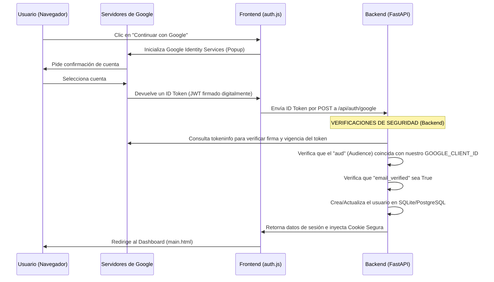

# 🔐 Autenticación Profesional con Google & Diseño 100% Responsive

¡Hola! En esta guía didáctica vamos a explicar paso a paso cómo implementamos la autenticación profesional con Google en el backend y cómo logramos que todo el sistema de Flujo sea 100% responsivo y adaptable a celulares, tablets y computadoras de escritorio.

---

## 🔑 1. Autenticación con Google a Nivel Profesional

Cuando usamos **Google Sign-In** en una aplicación web, no basta con recibir los datos del usuario en el navegador y guardarlos directamente. Un atacante malintencionado podría enviar datos falsos simulando ser Google.

Para hacerlo de forma **profesional y segura**, implementamos un flujo de verificación en dos pasos:



### ¿Qué validaciones agregamos en el Backend (`api/main.py`)?

1. **Validación de la Firma del Token (`/tokeninfo`)**:
   Consultamos a los servidores de Google para comprobar que el token recibido realmente fue generado y firmado por Google y que no está expirado.
   
2. **Validación del Audience (`aud`)**:
   ```python
   token_aud = token_data.get("aud", "")
   if GOOGLE_CLIENT_ID and token_aud != GOOGLE_CLIENT_ID:
       return JSONResponse(status_code=401, content={"error": "Token de Google no autorizado..."})
   ```
   **¿Por qué es importante?** Evita que un atacante use un token válido emitido por Google para *otra* aplicación e intente loguearse en nuestro gestor de finanzas. El token debe ser específico para nuestro `GOOGLE_CLIENT_ID`.

3. **Verificación de Email Verificado (`email_verified`)**:
   ```python
   email_verified = token_data.get("email_verified", "false")
   if str(email_verified).lower() != "true":
       return JSONResponse(status_code=401, content={"error": "El email no está verificado."})
   ```
   Google nos indica si el usuario ya validó su propiedad sobre ese correo electrónico. Si no está verificado, no le permitimos el acceso para prevenir usurpación de identidad.

4. **Cookies de Sesión Seguras Dinámicas (`https_only`)**:
   ```python
   IS_PRODUCTION = bool(os.getenv("RENDER")) or DATABASE_URL.startswith("postgresql")
   app.add_middleware(
       SessionMiddleware,
       secret_key=SECRET_KEY,
       session_cookie="flujo_session",
       max_age=86400 * 30,
       same_site="lax",
       https_only=IS_PRODUCTION  # True en Render (HTTPS), False en desarrollo local (HTTP)
   )
   ```
   * En **producción (Render)**, la cookie de sesión tiene el atributo `secure` (`https_only=True`), lo que significa que el navegador solo la transmitirá en conexiones cifradas HTTPS. Esto evita ataques de interceptación de red (Man-in-the-Middle).
   * En **desarrollo local (localhost)** se desactiva (`https_only=False`) para permitirnos probar la aplicación sobre HTTP sin problemas.

---

## 📱 2. Diseño 100% Responsive

Para que la aplicación se vea premium y adaptada a cualquier pantalla sin usar frameworks pesados, creamos un **bloque responsive unificado** al final de [styles.css](file:///h:/Gestor%20de%20Finanzas%20%28Actualizado%29%20-%20copia%20-%20copia/css/styles.css) utilizando **CSS Media Queries**.

### Breakpoints Definidos:
*   **Desktop grande / normal**: Diseño por defecto (pantallas > 1100px). Sidebar fijo a la izquierda, contenido principal a la derecha.
*   **Tablets / Laptops chicas (≤ 1100px)**:
    *   La cuadrícula del dashboard pasa a tener menos columnas.
    *   Los márgenes se reducen.
*   **Tablets verticales y Celulares (≤ 768px)**:
    *   El sidebar se convierte en un **overlay flotante** (fuera de la pantalla, con `transform: translateX(-100%)`).
    *   Se muestra el **botón Hamburguesa** en la barra superior (`topbar`) para abrir el menú lateral.
    *   Se implementa un **backdrop translúcido** detrás del menú abierto para centrar la atención y cerrar el menú si se hace clic fuera.
    *   La tabla de transacciones obtiene un wrapper con scroll horizontal (`.tx-table-wrap { overflow-x: auto; }`) para que las columnas no se encimen.
*   **Celulares pequeños (≤ 480px)**:
    *   La topbar se alinea de forma vertical u horizontal compacta.
    *   Las tarjetas de estadísticas del dashboard pasan a ocupar el 100% del ancho (una por fila).
    *   Los formularios y modales ocupan todo el ancho de la pantalla para facilitar la lectura.

### El Funcionamiento del Menú Hamburguesa (HTML + CSS + JS)

#### A. Estructura HTML (`main.html`)
Agregamos un fondo oscuro translúcido (`backdrop`) y un botón para abrir el menú antes del sidebar:
```html
<!-- Backdrop oscuro en móvil -->
<div class="sidebar-backdrop" id="sidebarBackdrop" onclick="toggleSidebar()"></div>

<!-- Botón hamburguesa en la barra superior (topbar) -->
<button class="hamburger-btn" id="hamburgerBtn" onclick="toggleSidebar()">
  <svg width="20" height="20" fill="none" stroke="currentColor" stroke-width="2" viewBox="0 0 24 24">
    <line x1="3" y1="12" x2="21" y2="12"></line>
    <line x1="3" y1="6" x2="21" y2="6"></line>
    <line x1="3" y1="18" x2="21" y2="18"></line>
  </svg>
</button>
```

#### B. Estilos CSS (`css/styles.css`)
El sidebar está oculto en pantallas pequeñas y se desliza con una suave animación (`transition`):
```css
@media (max-width: 768px) {
  .sidebar {
    position: fixed;
    top: 0; left: 0; bottom: 0;
    z-index: 1000;
    transform: translateX(-100%); /* Oculto a la izquierda */
    transition: transform 0.3s cubic-bezier(0.4, 0, 0.2, 1);
  }
  .sidebar.active {
    transform: translateX(0); /* Deslizar hacia adentro */
  }
  .sidebar-backdrop {
    display: none; /* Oculto por defecto */
    position: fixed;
    inset: 0;
    background: rgba(0, 0, 0, 0.6);
    backdrop-filter: blur(4px);
    z-index: 999;
  }
  .sidebar-backdrop.active {
    display: block; /* Se muestra cuando el menú está abierto */
  }
}
```

#### C. Lógica JavaScript (`js/app.js`)
La función `toggleSidebar()` añade o remueve la clase `.active` para desencadenar las transiciones CSS:
```javascript
function toggleSidebar() {
  const sidebar = document.getElementById('sidebar');
  const backdrop = document.getElementById('sidebarBackdrop');
  if (sidebar && backdrop) {
    sidebar.classList.toggle('active');
    backdrop.classList.toggle('active');
  }
}

// Además, cuando el usuario hace clic en una opción del menú en celular,
// el menú se cierra automáticamente:
function setPage(el, page) {
  // ... lógica de cambio de vista ...
  
  // Cerrar sidebar si estamos en móvil
  const sidebar = document.getElementById('sidebar');
  const backdrop = document.getElementById('sidebarBackdrop');
  if (sidebar && sidebar.classList.contains('active')) {
    sidebar.classList.remove('active');
    backdrop.classList.remove('active');
  }
}
```

---

## 🛠️ 3. Configuración en la Nube (`render.yaml`)

Para automatizar el despliegue en **Render** sin exponer credenciales sensibles, definimos las variables de entorno en el archivo de configuración de infraestructura:

```yaml
services:
  - type: web
    name: flujo-finance-manager
    env: python
    buildCommand: pip install -r api/requirements.txt
    startCommand: cd api && uvicorn main:app --host 0.0.0.0 --port $PORT
    envVars:
      - key: DATABASE_URL
        fromDatabase:
          name: flujo-db
          property: connectionString
      - key: GOOGLE_CLIENT_ID
        sync: false  # Se configura manualmente en el panel de Render por seguridad
      - key: SECRET_KEY
        generateValue: true  # Genera una clave secreta aleatoria segura automáticamente
```

*   `sync: false` en `GOOGLE_CLIENT_ID` le dice a Render que no sobrescriba este valor desde el repositorio de GitHub. De esta manera, el ID de cliente de Google de producción se configura directamente en el panel de Render de forma segura.
*   `generateValue: true` en `SECRET_KEY` asegura que cada despliegue tenga una clave secreta única para firmar las cookies de sesión.

---

¡Excelente trabajo! Con esto, Flujo cumple con altos estándares de seguridad en autenticación web y brinda una experiencia de usuario premium en cualquier dispositivo móvil.
