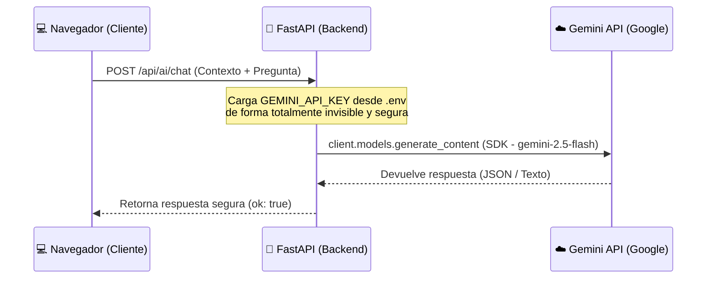

# Guía Didáctica: IA Insights y Seguridad en el Gestor de Finanzas ✦

Esta guía fue creada para ayudarte a comprender el diseño arquitectónico y de seguridad implementado para la nueva funcionalidad de **IA Insights** (Asistente Financiero IA y Análisis Automático).

---

## 1. Arquitectura de Comunicación: Cliente-Servidor (Proxy de Seguridad)

Para que la inteligencia artificial analice tus finanzas personales, los datos del usuario deben viajar a los servidores de Gemini (Google). Existen dos formas de comunicar estos componentes, pero solo una de ellas es segura:

### Diseño Inseguro (Llamada Directa desde el Frontend)
En sistemas sencillos o prototipos informales, el frontend de la aplicación (JavaScript en el navegador) realiza un `fetch()` directo a la API de la IA, enviando la clave API en la cabecera del mensaje.
* **El Riesgo**: La clave API queda escrita en los archivos JavaScript públicos. Cualquier usuario puede abrir las herramientas de desarrollador del navegador (F12) e inspeccionar las claves, utilizándolas de forma maliciosa.

### Diseño Seguro (Proxy en el Servidor - Implementado)
La arquitectura profesional implementada en este proyecto introduce a nuestro servidor **FastAPI en Python** como un "escudo" o proxy de seguridad:

De esta manera, el navegador **nunca** conoce ni tiene acceso a tu clave API de Gemini. Todo el proceso está centralizado en el servidor en la nube (Render).

---

## 2. Los Endpoints del Backend (`api/main.py`)

Se han añadido dos nuevos puntos de entrada en FastAPI para dar servicio a la interfaz:

### A. Endpoint `/api/ai/chat` (Asistente Financiero)
Este endpoint recibe un objeto que contiene:
1. `contexto_financiero`: Un texto estructurado que contiene el saldo, ingresos, gastos, objetivos y presupuestos actuales del usuario.
2. `pregunta`: El mensaje escrito por el usuario en el chat.
3. `historial`: Una lista con los mensajes anteriores de la sesión de chat para que Gemini tenga memoria de la conversación.

En Python, armamos el prompt del sistema especificando las directrices de personalidad (hablar en español argentino, ser directo, práctico y amigable) y lo enviamos junto con el historial al modelo `gemini-2.5-flash` mediante la SDK oficial.

### B. Endpoint `/api/ai/insights` (Tarjetas de Análisis Automático)
Este endpoint recibe únicamente el `contexto_financiero` y utiliza una de las características más avanzadas de Gemini: **Salida estructurada JSON**.
* Le indicamos al modelo en el prompt que su respuesta debe ser **estrictamente en formato JSON** y con una estructura de llaves exacta (`tipo`, `titulo`, `descripcion`, `icono`).
* Usando el parámetro `response_mime_type="application/json"` en el objeto `GenerateContentConfig` de la SDK, obligamos a Gemini a responder exclusivamente con el JSON esperado, eliminando cualquier texto descriptivo adicional. Esto previene errores en el frontend al procesar la respuesta.

---

## 3. Resiliencia y Control de Límites (Rate Limiting)

La versión gratuita del servicio de Google AI Studio posee límites de velocidad:
* **15 peticiones por minuto (RPM)**

Si varios usuarios realizaran escaneos y preguntas de chat muy seguidos, la API devolvería un código de error **HTTP 429 (Too Many Requests)**.
Para evitar que la aplicación falle, implementamos una lógica de **backoff exponencial** en la función del backend `_call_gemini_sdk_with_retry` capturando la excepción `APIError` del SDK oficial:
* Si se produce una excepción `APIError` y el código de estado es `429` (límite de cuota excedido), el servidor "se duerme" y espera:
  * Intento 1: Espera **2 segundos** y reintenta.
  * Intento 2: Espera **4 segundos** y reintenta.
  * Intento 3: Espera **8 segundos** y reintenta.
Esto suaviza las ráfagas de tráfico y asegura una excelente experiencia de usuario sin caídas de servicio.

---

## 4. Estructuración y Renderizado en el Frontend (`js/app.js` y `main.html`)

En el navegador del usuario:
1. **Recopilación**: La función `aiBuildContext()` de JavaScript lee los datos financieros guardados localmente en `localStorage` (específicos del usuario que inició sesión) y genera una plantilla de texto detallando el estado financiero del mes.
2. **Interactividad**: Al enviar un mensaje, JavaScript añade la burbuja del usuario y dibuja temporalmente un **typing indicator** (tres puntos animados con CSS `ai-bounce`) para hacer la interfaz viva y responsiva.
3. **Formatos**: Como la IA responde usando formato Markdown simple (por ejemplo, `**negritas**` o listas con guiones `- `), implementamos la función `aiFormatText()` en JavaScript que convierte estos símbolos básicos a etiquetas HTML (`<strong>`, ` `, viñetas) de manera segura antes de inyectarlos en la interfaz.
