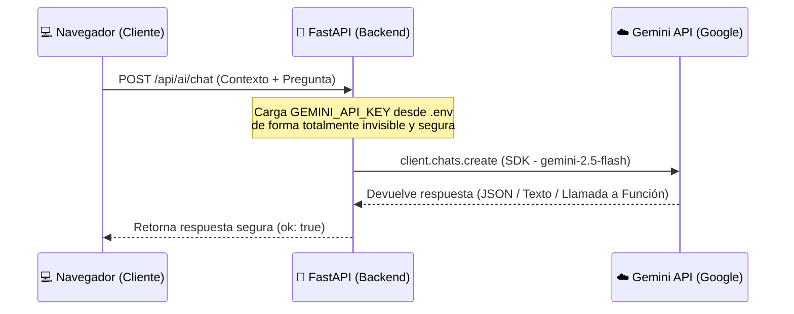

# Guía Didáctica: IA Insights y Seguridad en el Gestor de Finanzas ✦

Esta guía fue creada para ayudarte a comprender el diseño arquitectónico y de seguridad implementado para la nueva funcionalidad de **IA Insights** (Asistente Financiero IA y Análisis Automático).

---

## 1. Arquitectura de Comunicación: Cliente-Servidor (Proxy de Seguridad)

Para que la inteligencia artificial analice tus finanzas personales, los datos del usuario deben viajar a los servidores de Gemini (Google). Existen dos formas de comunicar estos componentes, pero solo una de ellas es segura:

### Diseño Inseguro (Llamada Directa desde el Frontend)
En sistemas sencillos o prototipos informales, el frontend de la aplicación (JavaScript en el navegador) realiza un `fetch()` directo a la API de la IA, enviando la clave API en la cabecera del mensaje.
* **El Riesgo**: La clave API queda escrita en los archivos JavaScript públicos. Cualquier usuario puede abrir las herramientas de desarrollador del navegador (F12) e inspeccionar las claves, utilizándolas de forma maliciosa.

### Diseño Seguro (Proxy en el Servidor - Implementado)
La arquitectura profesional implementada en este proyecto introduce a nuestro servidor **FastAPI en Python** como un "escudo" o proxy de seguridad:

```mermaid
sequenceDiagram
    participant Usuario as 💻 Navegador (Cliente)
    participant Servidor as 🐍 FastAPI (Backend)
    participant Gemini as ☁️ Gemini API (Google)
    
    Usuario->>Servidor: POST /api/ai/chat (Contexto + Pregunta)
    Note over Servidor: Carga GEMINI_API_KEY desde .env<br/>de forma totalmente invisible y segura
    Servidor->>Gemini: client.chats.create (SDK - gemini-2.5-flash)
    Gemini-->>Servidor: Devuelve respuesta (JSON / Texto / Llamada a Función)
    Servidor-->>Usuario: Retorna respuesta segura (ok: true)
```

De esta manera, el navegador **nunca** conoce ni tiene acceso a tu clave API de Gemini. Todo el proceso está centralizado en el servidor en la nube.

---

## 2. Clean Architecture y los Endpoints del Backend

En lugar de tener toda la lógica de la IA dentro del archivo del router (`api/routers/ai.py`), hemos refactorizado la aplicación siguiendo los principios de **Clean Architecture**.

Toda la lógica de comunicación con Gemini y la ejecución de herramientas ahora reside en `api/services/ai_service.py`. El router (`api/routers/ai.py`) es simplemente una capa de transporte que recibe la solicitud HTTP, valida la sesión, y delega el trabajo al `AIService`.

Para garantizar el aislamiento completo de la información y proteger los recursos, **todos los endpoints privados requieren de manera obligatoria una sesión activa** comprobada a través de `get_current_user_id(request)`.

### A. Endpoint `/api/ai/chat` (Asistente Financiero y Function Calling)
Este endpoint recibe:
1. `contexto_financiero`: Un texto estructurado que contiene el saldo, ingresos, gastos, objetivos y presupuestos actuales del usuario.
2. `pregunta`: El mensaje escrito por el usuario en el chat.
3. `historial`: Una lista con los mensajes anteriores.

**Innovación: Function Calling (Tools)**
Ahora, el asistente no solo responde con texto, sino que **puede ejecutar acciones** en el backend en tu nombre. Al enviarle la pregunta a Gemini, le pasamos una lista de "Herramientas" (`tools` parameter), que son funciones Python definidas en nuestro `AIService` (por ejemplo, `create_transaction` y `get_accounts_balance`). 
Cuando el modelo se da cuenta de que el usuario quiere registrar un gasto o verificar su saldo, en lugar de responder texto, le pide a nuestro servidor que ejecute esa función. La SDK de Gemini ejecuta la función automáticamente utilizando los repositorios del backend (`SQLAlchemyAccountRepository`, `SQLAlchemyTransactionRepository`) y le devuelve el resultado al modelo, que luego genera la respuesta final informando al usuario del éxito de la operación.

### B. Endpoint `/api/ai/insights` (Tarjetas de Análisis Automático)
Este endpoint recibe el `contexto_financiero` y utiliza **Salida estructurada JSON**.
* Le indicamos al modelo en el prompt que su respuesta debe ser estrictamente en formato JSON (`response_mime_type="application/json"`).
* Esto elimina la necesidad de parsear texto Markdown y previene errores en el frontend al procesar la respuesta para generar las tarjetas visuales.

---

## 3. Resiliencia y Control de Límites (Rate Limiting)

La versión de Google AI Studio posee límites de velocidad:
* **15 peticiones por minuto (RPM)**

Si varios usuarios realizaran escaneos y preguntas de chat muy seguidos, la API devolvería un código de error **HTTP 429 (Too Many Requests)**.
Implementamos una lógica de **backoff exponencial** en la función `_call_gemini_sdk_with_retry` de nuestro servicio:
* Si se produce una excepción `APIError` con el código `429`, el servidor espera y reintenta:
  * Intento 1: Espera **2 segundos** y reintenta.
  * Intento 2: Espera **4 segundos** y reintenta.
  * Intento 3: Espera **8 segundos** y reintenta.
Esto suaviza las ráfagas de tráfico y asegura una excelente experiencia de usuario sin caídas de servicio.

---

## 4. Estructuración y Renderizado en el Frontend (`js/app.js` y `main.html`)

En el navegador del usuario:
1. **Recopilación**: La función `aiBuildContext()` de JavaScript lee los datos financieros guardados localmente y genera una plantilla de texto.
2. **Interactividad**: Al enviar un mensaje, JavaScript añade la burbuja del usuario y dibuja temporalmente un **typing indicator**.
3. **Formatos**: Convertimos los símbolos Markdown (`**negritas**`, `- viñetas`) a etiquetas HTML seguras (`<strong>`, `<li>`) para renderizar visualmente las respuestas de Gemini en el chat.
