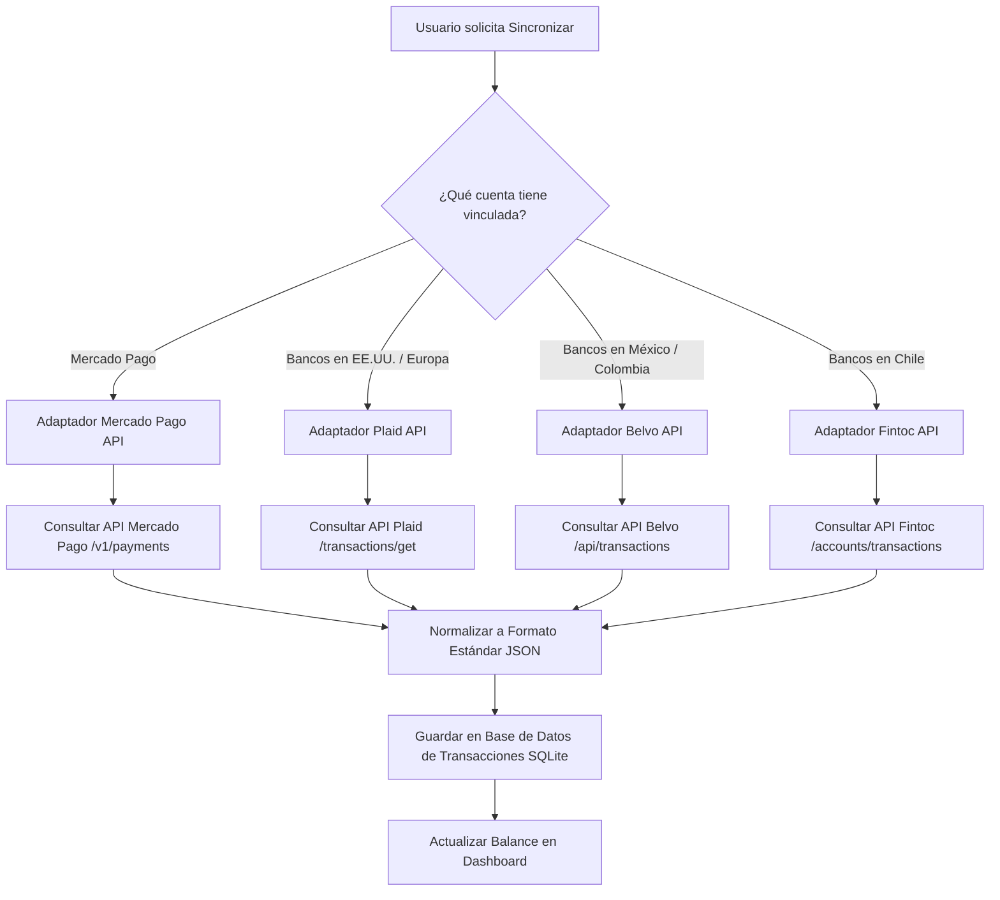

# 💳 Investigación: Sincronización Financiera e Integración de APIs de Pagos (Global y Local)

¡Hola! Como estudiante de desarrollo, aprender sobre integración de sistemas financieros te abrirá las puertas al desarrollo de aplicaciones fintech reales. Este documento detalla cómo diseñar una arquitectura multinacional que permita sincronizar gastos bancarios y billeteras virtuales de forma automática en la base de datos de nuestra aplicación.

Nuestra meta es la **coexistencia**: mantener la integración directa de **Mercado Pago** (nuestro motor principal para Latinoamérica) y poder conectarnos a otras APIs de Open Banking del resto del mundo (como Plaid, Belvo o pasarelas europeas) según el país de residencia del usuario.

---

## 🏛️ 1. Arquitectura de Integración Multiproveedor (El "Financial Router")

Para no sobrecargar la aplicación con código diferente para cada banco del mundo, implementamos un patrón de diseño llamado **Adapter** o **Router de Conexiones**. 

El backend expone un endpoint unificado `/api/sincronizar` y, según el país o la cuenta del usuario, delega el trabajo al adaptador correspondiente (Mercado Pago, Plaid, Belvo, etc.), transformando todas las respuestas de transacciones a una **estructura común** antes de guardarlas en la base de datos SQLite.

### Flujo de Sincronización Automática:



---

## 🔑 2. Detalle de Proveedores y APIs de Conexión

### A. Mercado Pago API (Core Latinoamericano)
Mercado Pago es ideal porque cubre gran parte de Sudamérica (Argentina, Chile, Colombia, México, Brasil, Uruguay, Perú).

*   **Flujo de Conexión (OAuth 2.0)**:
    1.  El usuario hace clic en "Conectar Mercado Pago".
    2.  Redirige a la página de inicio de sesión de Mercado Pago con tu `client_id`.
    3.  El usuario autoriza la app y Mercado Pago redirige de vuelta a nuestro backend con un código temporal (`code`).
    4.  El backend cambia el `code` por un `access_token` persistente llamando a:
        `POST https://api.mercadopago.com/oauth/token`
*   **Obtención de Transacciones**:
    Hacemos peticiones periódicas o bajo demanda al endpoint de pagos del usuario:
    `GET https://api.mercadopago.com/v1/payments/search?sort=date_created&criteria=desc`
*   **Webhooks (IPN)**: Mercado Pago nos notifica en tiempo real cada vez que el usuario realiza un pago o recibe dinero enviando una petición HTTP POST a nuestro servidor.

---

### B. Plaid API (Estándar para Norteamérica y Europa)
Plaid es el gigante mundial de la agregación de datos financieros. Conecta más de 11.000 bancos en EE. UU., Canadá, Reino Unido y Europa (incluyendo España).

*   **Cómo funciona**:
    1.  El frontend abre el componente interactivo **Plaid Link**.
    2.  El usuario busca su banco (ej: Chase, Santander, BBVA), ingresa sus credenciales de forma segura (encriptadas por Plaid) y autoriza la vinculación.
    3.  Plaid nos devuelve un token de acceso (`access_token`).
*   **Obtención de Movimientos**:
    El backend hace peticiones seguras para descargar el historial de gastos:
    `POST https://production.plaid.com/transactions/get`
    *Cuerpo del Request:*
    ```json
    {
      "client_id": "TU_CLIENT_ID",
      "secret": "TU_SECRET",
      "access_token": "access-prod-xxxxxxx",
      "start_date": "2026-05-01",
      "end_date": "2026-06-03"
    }
    ```

---

### C. Belvo API (Open Finance para México, Colombia y Brasil)
Belvo es el equivalente a Plaid adaptado a la infraestructura latinoamericana. Permite conectar tanto cuentas bancarias tradicionales como billeteras digitales y tributarias (SAT/DIAN).

*   **Puntos Fuertes**: Excelente cobertura para integrar la importación de movimientos de cuentas de ahorro colombianas o mexicanas (Bancolombia, BBVA Bancomer, Nequi, RappiPay).
*   **Conexión**: Utiliza un Widget de frontend similar a Plaid Link para vincular la cuenta bancaria del usuario de forma invisible y segura.

---

### D. Fintoc API (Chile y México)
En Chile, Fintoc es el estándar de Open Banking más rápido y seguro.
*   **Cómo funciona**: Ofrece servicios de lectura de movimientos bancarios corrientes y de tarjetas de crédito. A diferencia de las APIs tradicionales, está sumamente optimizado para la autenticación en dos factores (MFA) obligatoria en los bancos chilenos.

---

### E. PSD2 en España y Europa (Tink / Afterbanks)
En la Unión Europea existe una ley llamada **PSD2** (Directiva de Servicios de Pago 2) que obliga a todos los bancos a proveer APIs seguras y gratuitas para que aplicaciones autorizadas lean los movimientos de los clientes (con su previo permiso).
*   **Bizum**: Es el sistema de transferencias interbancarias directas de España. Bizum no ofrece una API abierta de consulta para particulares. Por lo tanto, para registrar gastos de Bizum, nos conectamos a la API PSD2 del banco del usuario (usando agregadores como **Tink** o **Afterbanks**) y leemos las transferencias entrantes/salientes etiquetadas como *"Bizum"*.

---

## 🛠️ 3. Adaptador de Datos Común (Normalización)

Para que el frontend de la aplicación siempre vea los datos de la misma forma, el backend normaliza las respuestas de las APIs al siguiente esquema común antes de insertarlas en SQLite:

```json
{
  "id_transaccion_externa": "mp-987654321", // ID único de Plaid, MP, o Belvo
  "proveedor": "mercado_pago", // 'mercado_pago', 'plaid', 'belvo', 'fintoc'
  "nombre_comercio": "Starbucks Coffee",
  "monto": 4500.00,
  "moneda": "ARS", // USD, EUR, CLP, etc.
  "fecha": "2026-06-03",
  "hora": "14:22:00",
  "categoria_sugerida": "Alimentación",
  "metodo_pago": "Tarjeta de crédito"
}
```

---

## 🎓 Conclusión didáctica para tu proyecto

Diseñar una aplicación financiera internacional no significa escribir código desde cero para cada banco del planeta. Significa crear una **arquitectura flexible** que use:
1.  **Mercado Pago** para dar cobertura de billeteras virtuales en toda Latinoamérica.
2.  **Belvo** y **Fintoc** para bancos tradicionales en México, Colombia y Chile.
3.  **Plaid** y **PSD2 APIs** para España, Europa y Estados Unidos.

Todo unificado bajo un mismo formato de base de datos para que la experiencia del usuario sea fluida, segura y automática en cualquier parte del mundo.
