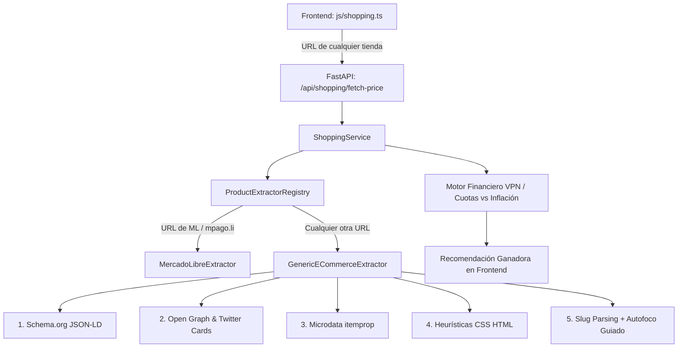

# PROMPT DE INGENIERÍA: ASISTENTE DE COMPRAS E INTEGRACIÓN CON MERCADO LIBRE

Copie y pegue el siguiente bloque de texto en su IDE (Cursor, VS Code con Copilot, ChatGPT o Claude) para generar la implementación completa de la funcionalidad del Asistente de Compras Inteligente.

---

```text
ACTÚA COMO UN ARQUITECTO DE SOFTWARE Y DESARROLLADOR FULL-STACK EXPERTO. 

Necesito implementar una funcionalidad avanzada de "Asistente de Compras Inteligente" para mi aplicación de gestión de gastos personales. El objetivo es que el usuario pueda ingresar un producto de Mercado Libre (por búsqueda, pegando el link o escaneando el código de barras) y el sistema le recomiende la mejor opción financiera de pago, basándose en los saldos y tarjetas que tiene registrados en la app.

### 1. STACK TECNOLÓGICO
- **Frontend:** Flutter (Mobile).
- **Backend:** API REST con FastAPI (Python).
- **Base de Datos:** PostgreSQL.

---

### 2. ARQUITECTURA Y REQUERIMIENTOS TÉCNICOS

#### A. MODELO DE DATOS (PostgreSQL / FastAPI)
Genera los modelos de BD y esquemas Pydantic para soportar las finanzas del usuario. Asume que estas tablas ya tendrán datos simulados:
1. `cuentas_billeteras`: (id, usuario_id, nombre_cuenta, tipo_cuenta ['Débito', 'Crédito', 'Billetera Virtual'], saldo_disponible, limite_credito).

#### B. ENDPOINTS DEL BACKEND (FastAPI)
Genera los siguientes endpoints con buenas prácticas (APIRouter, inyección de dependencias, manejo de errores):

1. **`POST /api/v1/compras/analizar-url`**: 
   - Recibe una URL de Mercado Libre y extrae el ID del artículo (Regex).
   - Consume la API de Mercado Libre (`[https://api.mercadolibre.com/items/](https://api.mercadolibre.com/items/){item_id}`) para obtener: precio y moneda.
   - **Endpoint Dinámico:** Este endpoint también debe recibir (opcionalmente) parámetros ingresados por el usuario desde la UI, como `% de descuento bancario` o `cantidad de cuotas sin interés específicas de su banco`.
   - Ejecuta el **Motor de Recomendación** (Sección 3) y devuelve las opciones de pago ordenadas por conveniencia.

2. **`GET /api/v1/compras/buscar`**:
   - Recibe un `q` (ej: "Auriculares").
   - Consume la API de ML (`[https://api.mercadolibre.com/sites/MLA/search?q=](https://api.mercadolibre.com/sites/MLA/search?q=){query}`).
   - Retorna los primeros 5 resultados (ID, título, precio, thumbnail) limpios para Flutter.

3. **`POST /api/v1/compras/analizar-codigo`**:
   - Recibe un GTIN/EAN.
   - Consume la API de ML (`[https://api.mercadolibre.com/products/search?gtin=](https://api.mercadolibre.com/products/search?gtin=){codigo}`).
   - Retorna la info del producto y ejecuta el **Motor de Recomendación**.

#### C. COMPONENTES DEL FRONTEND (Flutter)
Genera el código de Flutter organizado (Widgets, State Management y Services):

1. **Pantalla Principal (`AsistenteComprasScreen`)**: Centraliza los 3 métodos de entrada:
   - *Pestaña Buscador:* Barra de búsqueda nativa que renderiza tarjetas. Al tocar un producto, dispara el análisis.
   - *Pestaña Link:* Campo inteligente para pegar URLs manuales.
   - *Pestaña Escáner:* Botón para iniciar la cámara (usa `mobile_scanner`) y capturar códigos de barras.
2. **Share Intent (`ShareIntentService`)**: Configuración con `receive_sharing_intent` para interceptar enlaces de ML compartidos desde fuera de la app y llevar al usuario directo al análisis.
3. **Vista de Resultados Interactiva (`ResultadoAnalisisScreen`)**:
   - Muestra el precio base del producto y las opciones de pago que detectó la API.
   - **CRÍTICO - ENFOQUE HÍBRIDO (Input-First):** Debe incluir una sección tipo formulario rápido donde el usuario pueda ingresar manualmente si tiene alguna promoción bancaria (ej. "Descuento %" o "X cuotas sin interés"). Al ingresar un dato, la pantalla debe recalcular todo al instante.
   - Destaca la **Opción Ganadora** (ej. "Pagá con Tarjeta Crédito en 3 cuotas") y explica matemáticamente por qué (usando VPN, TNA, CFT). Muestra una lista secundaria con el resto de las cuentas registradas del usuario.

---

### 3. LÓGICA DEL MOTOR DE RECOMENDACIÓN (Algoritmo Financiero)
Crea una función de evaluación en Python que use métricas financieras formales (como Valor Presente Neto - VPN o Costo Financiero Total - CFT) para ranquear las cuentas del usuario contra el producto.
- **Validación:** Si es Débito/Billetera, `saldo_disponible` >= precio. Si es Crédito, `limite_credito` >= precio. Si falla, va al final de la lista marcado como "Fondos Insuficientes".
- **Cálculo Base:** Prioriza cuotas sin interés si la inflación o TNA estimada de referencia (ej. 40%) indica que el dinero rinde más en un FCI (Costo de Oportunidad).
- **Recálculo por Usuario:** Si el usuario mandó parámetros extra desde la UI (ej. 15% de reintegro por su banco), el algoritmo debe aplicar ese descuento al cálculo final y posiblemente cambiar el ranking de la opción ganadora.

---

### 4. CRITERIOS DE ACEPTACIÓN
1. Manejo estricto de errores (404 si ML no encuentra el producto, 500 si falla la API).
2. Arquitectura limpia en Flutter (especifica Provider, BLoC o Riverpod).
3. Todo el código comentado en español explicando la matemática financiera oficial utilizada.
4. UI en pesos argentinos (ARS) con formato `$ ###.###,##`.

Por favor, genera el código paso a paso: Modelos y Endpoints (FastAPI), Motor Matemático (Python), y UI/Services (Flutter).
```

---

## 5. ANÁLISIS TÉCNICO: FACTIBILIDAD DE OBTENCIÓN AUTOMÁTICA DE PRECIOS DE MERCADO LIBRE

### A. Diagnóstico de la Situación Técnica
1. **APIs Públicas de Mercado Libre (`api.mercadolibre.com`):**
   - Desde 2024, Mercado Libre cerró los accesos anónimos a sus endpoints de items (`/items/{id}`) y búsqueda (`/sites/MLA/search`).
   - Cualquier petición HTTP sin un token de desarrollador OAuth aprobado recibe un error **`HTTP 403 Forbidden`** con el código de política interna `PA_UNAUTHORIZED_RESULT_FROM_POLICIES` ("At least one policy returned UNAUTHORIZED").
2. **Scraping HTML (`articulo.mercadolibre.com.ar`):**
   - El dominio web está protegido por Akamai Bot Manager y Cloudflare WAF.
   - Peticiones procedentes de servidores cloud (Render, AWS, GCP, etc.) o clientes automatizados son redirigidas de inmediato con **`HTTP 302 Found`** a `https://www.mercadolibre.com.ar/gz/account-verification` (desafío de verificación de cuenta / CAPTCHA).
3. **Restricción CORS en el Navegador:**
   - Intentar hacer un `fetch` directo desde JavaScript a las páginas web de Mercado Libre es bloqueado por la política de seguridad Same-Origin (CORS) del navegador.

### B. Solución y Rediseño de la Experiencia (Arquitectura Híbrida)
Dado que un bot scraping sin proxies residenciales ni credenciales corporativas no es viable ni confiable en producción, se implementó el **Enfoque Híbrido "Simulador de Compras Inteligente"**:
1. **Extracción Inmediata de Metadata desde la URL:**
   - El frontend y backend analizan el slug de la URL (`/MLA-xxxx-nombre-del-producto...`) y extraen el nombre limpio del producto en 0 milisegundos sin depender de peticiones externas.
   - Muestra instantáneamente el badge: `📦 Producto: {Nombre Detectado}`.
2. **Foco Directo en el Precio:**
   - En lugar de dejar al usuario esperando 15 segundos con un spinner de carga que terminará en error 403, la interfaz le solicita el precio con foco automático: `💡 Por seguridad de Mercado Libre, ingresá el precio publicado para calcular cuotas vs inflación`.
3. **Motor Local de Recomendación Financiera (VPN):**
   - Si el backend está offline o no disponible, el frontend ejecuta localmente la misma fórmula de Valor Presente Neto ($VPN = \text{Cuota} \times \frac{1 - (1 + \text{TEM})^{-n}}{\text{TEM}}$).
   - Compara las tarjetas de crédito del usuario en 1, 3, 6, 9, 12, 18 y 24 cuotas contra el rendimiento de una TNA de referencia (40%), destacando cuál opción le gana a la inflación.

### C. Integración con Token OAuth de Mercado Pago vinculado
Para usuarios que han vinculado su cuenta de Mercado Pago en la aplicación (con los permisos `read`, `offline_access` habilitados en Mercado Pago Developers):
1. **Endpoint `GET /api/shopping/fetch-price?url=...`:**
   - Recupera de forma segura el `access_token` descifrado del usuario desde `cuentas_billeteras` / `wallet_connections`.
   - Realiza la consulta a la API de Mercado Libre (`https://api.mercadolibre.com/items/{item_id}` y `/products/{item_id}`) enviando el encabezado de autenticación `Authorization: Bearer {user_token}`.
2. **Autocompletado Reactivo en Frontend (`js/shopping.ts`):**
   - Al pegar o ingresar el enlace en el campo de URL, tras 500ms de debounce se dispara la petición al backend.
   - Si la API responde con éxito, el precio se inyecta automáticamente en el campo `#shoppingPrice` con retroalimentación visual (borde verde/turquesa y badge "✨ Precio obtenido con tu Mercado Pago vinculado").
   - Si la publicación específica no permite lectura remota o no hay cuenta vinculada, la interfaz muestra de forma elegante el mensaje orientativo solicitando el ingreso manual sin bloquear la experiencia del usuario.

---

## 6. EXPANSIÓN MULTITIENDA: ARQUITECTURA UNIVERSAL DE ASISTENTE DE COMPRAS (MÁS ALLÁ DE MERCADO LIBRE)

### A. Contexto y Desafío de Ingeniería
Originalmente, el asistente de compras estaba acoplado a Mercado Libre y a su ecosistema de APIs y tokens de Mercado Pago. Sin embargo, en el mundo real, los usuarios adquieren productos en decenas de comercios electrónicos diferentes:
- **Tiendas locales de electrodomésticos y retail:** Frávega, Garbarino, Cetrogar, Musimundo, Carrefour.
- **Tiendas globales y cross-border:** Amazon, Tiendamia, eBay, AliExpress.
- **Tiendas de marca directa y plataformas SaaS:** Sitios creados sobre **Shopify, WooCommerce, Magento, PrestaShop o VTEX** (Nike, Adidas, librerías, casas de informática como CompraGamer o Venex).

A diferencia de Mercado Libre, estas plataformas **no comparten una API unificada ni un sistema OAuth común**. Diseñar un extractor específico para cada una de las millones de webs existentes violaría los principios de mantenibilidad y escalabilidad.

### B. Solución Arquitectural: Patrón Strategy + Registry y Extracción Semántica Universal

Para resolver este desafío con calidad de ingeniería de software clase mundial (Google-grade) y manteniendo la arquitectura **PHAME/Hexagonal**, se implementó el desacoplamiento en dos capas:



#### 1. Principios SOLID Aplicados
- **Single Responsibility Principle (SRP):** `ShoppingService` ahora es puramente un orquestador de casos de uso y cálculo financiero. La lógica de scraping y comunicación HTTP vive exclusivamente en los extractores.
- **Open/Closed Principle (OCP):** El sistema está abierto a la extensión y cerrado a la modificación. Para dar soporte especializado a una nueva tienda (por ejemplo, con autenticación propietaria), basta con implementar `IProductExtractor` y registrarlo en `ProductExtractorRegistry` sin tocar ni una sola línea de `ShoppingService`.
- **Liskov Substitution Principle (LSP):** Tanto `MercadoLibreExtractor` como `GenericECommerceExtractor` cumplen con la interfaz `IProductExtractor`, devolviendo el mismo contrato de datos normalizado (`title`, `price`, `currency_id`, `domain`, `source`, `ok`).
- **Interface Segregation Principle (ISP):** La interfaz `IProductExtractor` declara únicamente los métodos estrictamente necesarios: `can_handle(url)` y `extract(url, ...)`.
- **Dependency Inversion Principle (DIP):** El servicio depende de la abstracción (`IProductExtractor`), facilitando mocks y pruebas unitarias aisladas sin red real.

#### 2. Jerarquía de Extracción Semántica en `GenericECommerceExtractor`
Para extraer con precisión quirúrgica el producto y su precio sin importar la tecnología del comercio:
1. **Schema.org en JSON-LD (`<script type="application/ld+json">`):** Estándar internacional exigido por Google para indexación de Google Shopping y SEO. En el 90%+ de las tiendas (Shopify, VTEX, WooCommerce, Magento), contiene un JSON estructurado con `@type: "Product"` y sus `offers: { "price": ..., "priceCurrency": ... }`.
2. **Open Graph Protocol & Twitter Cards (`og:price:amount`, `og:title`):** Metadatos utilizados por WhatsApp, Telegram y redes sociales para generar vistas previas de enlaces.
3. **Microdata HTML (`itemprop="price"`, `itemprop="name"`):** Atributos semánticos inline en el DOM.
4. **Heurísticas CSS & Sanitizador Numérico Regional:** Parser inteligente que interpreta tanto el formato de miles latino (`$ 1.250.000,50`) como anglosajón (`$1,250.00`).
5. **Manejo Resiliente ante WAF / Anti-Bot (Cloudflare, Akamai):** Si una tienda bloquea la petición HTTP automatizada (código 403 / captcha), el extractor extrae el nombre legible del producto y el dominio desde el slug de la URL en 0 milisegundos, y la interfaz guía al usuario con auto-enfoque al campo de precio: `"Por seguridad de {dominio}, ingresá el precio publicado para calcular cuotas vs inflación"`.

### C. Experiencia en Frontend (`js/shopping.ts`)
- **Aceptación Universal de Enlaces:** El debounce reactivo de 500ms analiza cualquier URL que inicie con `http://` o `https://`.
- **Badges Contextuales:**
  - Si es Mercado Libre con cuenta vinculada: `✨ Precio obtenido con tu Mercado Pago vinculado`.
  - Si es otra tienda: `✨ Precio autodetectado desde {dominio}`.
  - Si la tienda requiere precio manual: Notificación clara orientando al usuario a ingresar el precio para ejecutar el simulador de cuotas vs inflación.
- **Evaluación Financiera Homogénea:** La matemática de Valor Presente Neto ($VPN$) y análisis de Costo Financiero Total se aplica de manera idéntica sea cual sea la tienda de origen, maximizando el ahorro del usuario frente a la inflación.

---

## 7. MÓDULO INTEGRAL DE COMPRAS: MULTIMODALIDAD, FINANZAS CON RECARGO Y REGISTRO DIRECTO

### A. Selector Multimodal de Entrada (3 Modos)
La interfaz expone ahora tres formas complementarias para analizar compras sin salir de la plataforma:
1. **Pestaña `Link Web` (Universal):** Acepta URLs de cualquier e-commerce y autocompleta precio y título mediante el registro de extractores semánticos.
2. **Pestaña `Buscar Producto` (Catálogo en Tiempo Real):** Permite ingresar términos como *"Smart TV 50"*, consume el endpoint `/api/shopping/search?q=...` y renderiza tarjetas interactivas con foto, título, precio y botón `[⚡ Analizar Cuotas]`.
3. **Pestaña `Código de Barras`:** Admite códigos EAN/GTIN de productos físicos o escaneados en góndola y consume `/api/shopping/analyze-barcode`.

### B. Profundidad Financiera: Simulador de Cuotas con Interés vs Contado
En economías con inflación, no todas las cuotas son "sin interés". Muchas veces el comercio ofrece:
- **Precio Contado:** $\$ 100.000$
- **Precio Financiado (6 cuotas):** $\$ 120.000$ ($20\%$ de recargo total).

El motor evalúa si el costo del recargo financiero es inferior o superior a la inflación/rendimiento proyectado de la TNA:
$$VPN = \sum_{t=1}^n \frac{\text{Cuota}}{(1 + \text{TEM})^t}$$
- Si $VPN < \text{Precio Contado}$, el sistema dictamina: *"¡Conviene pagar en cuotas! A pesar del recargo, ajustado por rendimiento/inflación tu costo real es menor"*.
- Si $VPN > \text{Precio Contado}$, el sistema dictamina: *"Conviene pagar al contado: el recargo que te cobran supera el rendimiento proyectado"*. La tarjeta de débito o efectivo pasa al primer puesto del ranking.

### C. Integración con el Gestor de Gastos y Presupuestos
1. **Alerta Preventiva de Impacto en Presupuesto (`Budget Impact`):**
   - Cruza el precio o cuota mensual con los presupuestos activos del usuario (`state.budgets`).
   - Muestra una insignia dinámica con semáforo:
     - 🟢 **Saludable:** Consume $< 35\%$ del cupo restante.
     - 🟡 **Atención:** Consume entre $35\%$ y $75\%$.
     - 🔴 **Alerta crítica:** Supera o compromete más del $75\%$ del presupuesto del mes.
2. **Botón Directo `[💳 Registrar esta Compra como Gasto]`:**
   - La tarjeta recomendada (y las alternativas) incluye una acción con 1 clic.
   - Crea la transacción directamente con `TransactionService.addTransaction()`, asociando la cuenta o tarjeta seleccionada, la categoría *"Compras"* y la fecha actual.
   - Actualiza inmediatamente los balances, gráficos y presupuestos en toda la aplicación (`renderAll()`).

### D. Historial de Consultas Recientes
- Se persisten localmente las últimas simulaciones en `localStorage` (`gestor_shopping_history`).
- Se renderiza una botonera de chips interactivos con acceso rápido para re-analizar productos previamente consultados.