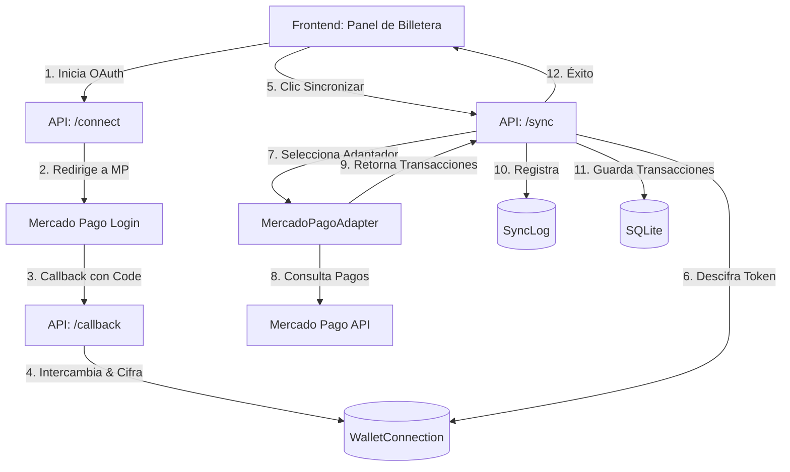

# 📱 Explicación de la Sincronización de Billetera Virtual (Fase 2-4)

¡Hola! En esta guía didáctica vas a encontrar la explicación detallada de la arquitectura profesional que diseñamos para integrar billeteras virtuales (Mercado Pago) en el proyecto **Flujo**. Hemos evolucionado de una solución básica (texto plano) a una arquitectura robusta, escalable y segura, típica de aplicaciones Fintech reales.

---

## 🏗️ Nueva Arquitectura Escalable

La integración ahora se compone de los siguientes elementos clave:

---

## 1. 🔌 El Patrón Adapter (Escalabilidad)

Para que el backend pueda conectarse a Mercado Pago, pero también estar preparado para Plaid o Belvo en el futuro sin reescribir todo el código, implementamos el **Patrón Adapter**.

*   **`BaseWalletAdapter`**: Una clase abstracta en `api/wallet_adapters/base_adapter.py` que define el contrato. Todo adaptador debe tener métodos como `get_auth_url()`, `exchange_code()`, y `fetch_transactions()`. Todas las transacciones devuelven un formato unificado: `NormalizedTransaction`.
*   **`MercadoPagoAdapter`**: La implementación real en `api/wallet_adapters/mercadopago_adapter.py`. Maneja toda la complejidad de la API de Mercado Pago, su paginación y categorización heurística de transacciones.
*   **Stubs**: Existen `plaid_adapter.py` y `belvo_adapter.py` como esqueletos para el futuro cuando haya financiamiento para pagar sus licencias.

---

## 2. 🔑 Flujo OAuth 2.0 y PKCE (Legalidad)

Ya no le pedimos al usuario que pegue manualmente un token. Ahora usamos el flujo estándar de la industria (OAuth 2.0 con PKCE):

1.  **`/api/wallets/mercadopago/connect`**: Genera un enlace seguro con un "code_challenge" (PKCE) y redirige al usuario a iniciar sesión en Mercado Pago.
2.  **`/api/wallets/mercadopago/callback`**: Mercado Pago nos envía un código de autorización. Lo intercambiamos por un `access_token` (para leer datos) y un `refresh_token` (para renovar el acceso).
3.  **Refresco automático**: Si el token está por expirar, el backend automáticamente usa el `refresh_token` para obtener uno nuevo antes de sincronizar.

---

## 3. 🗄️ Nuevos Modelos de Base de Datos

Hemos extraído la lógica de billeteras a tablas dedicadas en `api/main.py`:

*   **`WalletConnection`**: Guarda el estado de la conexión (`active`, `expired`, `revoked`), y los tokens de acceso y refresco *cifrados* con Fernet.
*   **`SyncLog`**: Una tabla de auditoría. Cada vez que se sincroniza una cuenta (exitosa o fallida), se guarda un registro con la duración, cuántas transacciones se importaron, y el mensaje de error si lo hubo. Esto es vital para dar soporte al usuario.

---

## 4. 🔔 Webhooks (Profesionalismo)

Para que el sistema sea eficiente, no necesitamos que el usuario presione "Sincronizar" todos los días (ni hacer *polling* constante al servidor).

*   **Endpoint `/api/webhooks/mercadopago`**: Escucha notificaciones IPN (Instant Payment Notification) de Mercado Pago. Cuando el usuario paga algo, MP nos avisa inmediatamente a este endpoint.
*   **Validación HMAC**: Verificamos la firma criptográfica (`x-signature`) para asegurar que el mensaje realmente viene de Mercado Pago y no de un atacante.

---

## 5. 🖥️ Interfaz de Usuario Mejorada

En el frontend (`js/app.js` y el HTML inyectado dinámicamente):

*   **Estado de conexión**: Muestra visualmente mediante "Badges" si la billetera está 🟢 CONECTADA, 🟡 EXPIRADA o 🔴 DESCONECTADA.
*   **Última sincronización**: Debajo del botón de sincronizar, el usuario puede ver cuándo fue la última vez que sus datos se actualizaron y si fue exitoso (ej. *"Última sync: hace 5 min ✓"*).
*   **Desconectar**: Permite al usuario revocar el acceso a su billetera de manera segura.

*Nota: Por compatibilidad con desarrollo local, seguimos soportando el ingreso manual de la palabra "mock-token" para generar datos de prueba.*
